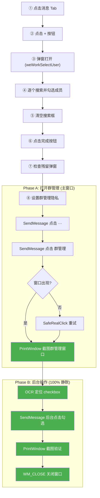

# 🤖 企微自动建群 Agent

> 在 Windows 后台自动操作企业微信，实现「客户 + 客服 + 老板」的外部群聊自动创建，并自动勾选隐私设置。
>
> **Go + Wails 原生架构 · 单 EXE 发布 · OCR 驱动定位 · 后台静默执行**

---

## ✨ 功能特性

| 功能 | 说明 |
|------|------|
| 🏗️ **一键批量建群** | 从企业 API 拉取新客户，自动创建 4 人外部群 |
| 🔍 **智谱 AI OCR** | 云端高精度 OCR（99%+），动态定位 UI 元素 |
| 🖱️ **后台静默操作** | SendMessage 后台点击 + PrintWindow 后台截图 |
| 🔒 **隐私自动设置** | 建群后自动勾选「禁止互相添加为联系人」|
| 📦 **单 EXE 发布** | Go + Wails 编译，~15MB，零依赖 |
| 🎛️ **现代 GUI** | Wails v2 + HTML/CSS/JS 前端管理界面 |

---

## 🏗️ 技术架构

```
┌────────────────────────────────────────────────────────┐
│                 WeComAutoGroup (Go/Wails)               │
├────────────────────────────────────────────────────────┤
│                                                        │
│  ┌──────────────┐  ┌──────────────┐  ┌──────────────┐  │
│  │ WeComWindow  │  │  智谱 AI OCR │  │  企业 API    │  │
│  │              │  │              │  │              │  │
│  │ SendMessage  │  │ 云端文字识别  │  │ 外部联系人   │  │
│  │ PrintWindow  │  │ 99%+ 精度    │  │ 客户群成员   │  │
│  │ flag=0 截图  │  │ 坐标定位     │  │ 状态追踪     │  │
│  └──────────────┘  └──────────────┘  └──────────────┘  │
│                                                        │
│  wecom_window.go     zhipu_ocr.go     server_api.go    │
│  create_group.go     privacy_tool.go  app_backend.go   │
└────────────────────────────────────────────────────────┘
```

### 核心技术

| 技术 | 用途 | 说明 |
|------|------|------|
| `SendMessage` | 后台点击/输入 | 不抢鼠标键盘，用户正常使用电脑 |
| `PrintWindow(flag=0)` | 后台截图 | 捕获 Chromium 渲染窗口内容 (**flag=0 关键!** PW_CLIENTONLY 返回黑屏) |
| `EnumWindows` | 窗口探测 | 自动发现群管理独立窗口 |
| `WM_CLOSE` | 后台关闭 | 静默关闭群管理窗口 |
| 智谱 AI OCR | 文字识别 | 替代本地 OCR，精度 99%+，跨分辨率适配 |

---

## 📁 项目结构

```
wecom-auto-group/
├── main.go              # 入口 (Wails GUI 启动 + CLI 诊断工具)
├── app_backend.go       # Wails 后端 (定时巡检 + 状态管理)
├── create_group.go      # 建群核心流程 (8 步 OCR 驱动)
├── wecom_window.go      # Windows 窗口操作 (截图/点击/查找)
├── privacy_tool.go      # 群管理隐私设置 (PrintWindow + SendMessage 后台)
├── zhipu_ocr.go         # 智谱 AI OCR 对接
├── server_api.go        # 企微 API (通过中转服务器绕 IP 白名单)
├── group_result.go      # 建群结果结构体
├── window_spy.go        # 窗口枚举诊断工具
├── click_check.go       # SendMessage 后台点击验证工具
├── screenshot_check.go  # PrintWindow 截图能力测试工具
├── diag_check.go        # OCR + 截图一体化诊断
├── frontend/            # Wails 前端 (HTML/CSS/JS)
└── build_go.bat         # 构建脚本
```

---

## 🔄 建群流程



---

## 🛠️ 关键技术发现

### 群管理窗口是独立原生窗口！

> **发现日期**: 2025-04-18
> **影响**: 群管理隐私设置从"必须前台操作"升级为"100% 后台静默"

之前以为群管理面板是 Chromium CSS Overlay（内嵌在主窗口中），导致必须用 BitBlt 前台截图 + mouse_event 真实鼠标点击。

**实际发现**: 群管理面板是一个**独立的顶级 Win32 窗口**！

| 属性 | 值 |
|------|-----|
| 窗口类名 | `ExternalConversationManagerWindow` |
| 窗口标题 | `"群管理"` |
| Parent | `0x0` (顶级窗口) |
| 类型 | 原生 Win32 窗口 (非 Chromium) |

这意味着：
- ✅ `PrintWindow` 后台截图正常工作（44KB 清晰图片）
- ✅ `SendMessage` 后台点击正常工作（不抢鼠标）
- ✅ `WM_CLOSE` 可直接关闭窗口
- ✅ OCR 识别 checkbox 位置精确

### PrintWindow flag=0 vs PW_CLIENTONLY

| flag | 主窗口 (Chromium) | 群管理窗口 (原生) |
|------|-------------------|------------------|
| `flag=0` | ✅ 可能有效 (193KB) | ✅ 有效 |
| `PW_CLIENTONLY=1` | ❌ 全黑 (4.6KB) | ✅ 有效 |
| `PW_RENDERFULLCONTENT=2` | ❌ 全黑 | ✅ 有效 |

> **结论**: 对企微主窗口 (Chromium)，必须用 `flag=0`。`PW_CLIENTONLY` 会导致黑屏。
> 代码中 `screenshotHwnd()` 已实现自动降级：先 flag=0，失败再 PW_CLIENTONLY。

---

## 📋 CLI 诊断工具

```bash
# 窗口 + OCR 诊断
WeComAutoGroup.exe --diag

# 深度窗口枚举
WeComAutoGroup.exe --spy-windows

# 后台点击验证 (SendMessage)
WeComAutoGroup.exe --click-test

# PrintWindow 截图能力测试
WeComAutoGroup.exe --screenshot-test

# 隐私设置完整流程测试
WeComAutoGroup.exe --privacy-test
```

---

## 📋 环境要求

- Windows 10/11
- 企业微信 PC 版（已登录）
- 网络连接（智谱 AI OCR + 企微 API 中转）
- Go 1.26+（开发时需要）

---

## 📝 注意事项

1. **企微窗口**：保持在桌面上即可（可被遮挡），不能最小化到托盘
2. **❗ 禁止 ESC**：代码中绝对不能发送 ESC 键，WeCom 收到 ESC 会最小化到系统托盘
3. **网络依赖**：需要网络访问智谱 AI API 和企微 API 中转服务器
4. **防风控**：内置 `humanDelay()` 随机延时模拟人类操作节奏
5. **测试账号**：配置中的测试账号跳过所有去重和限制

---

## 📄 License

MIT License
