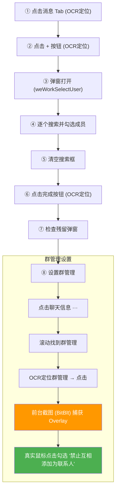

# 🤖 企微自动建群 Agent

> 在 Windows 后台自动操作企业微信，实现「客户 + 客服 + 老板」的外部群聊自动创建，并自动勾选隐私设置。
>
> **纯后台 · 不抢鼠标 · 不抢键盘 · 用户无感**（仅群管理设置需短暂前台化约 2 秒）

---

## ✨ 功能特性

| 功能 | 说明 |
|------|------|
| 🏗️ **一键批量建群** | 从企业 API 拉取新客户，自动创建 4 人外部群 |
| 🔍 **智谱 AI OCR** | 云端高精度 OCR（99%+），不依赖本地模型 |
| 🖱️ **后台静默操作** | SendMessage 后台点击 + PrintWindow 后台截图 |
| 🔒 **隐私自动设置** | 建群后自动勾选「禁止互相添加为联系人」 |
| 📦 **轻量打包** | 单 EXE（~29MB），无需安装 Python 环境 |
| 🎛️ **GUI 管理界面** | Tkinter 原生界面，支持配置员工、API、运行模式 |

---

## 🏗️ 技术架构

```
┌────────────────────────────────────────────────────────┐
│                    WeComAutoApp (GUI)                   │
│                      app.py / EXE                      │
├────────────────────────────────────────────────────────┤
│                                                        │
│  ┌──────────────┐  ┌──────────────┐  ┌──────────────┐  │
│  │ WeComWindow  │  │  智谱 AI OCR │  │  企业 API    │  │
│  │              │  │              │  │              │  │
│  │ SendMessage  │  │ 云端文字识别  │  │ 外部联系人   │  │
│  │ PrintWindow  │  │ 99%+ 精度    │  │ 客户同步     │  │
│  │ mouse_event  │  │ 坐标定位     │  │ 状态追踪     │  │
│  └──────────────┘  └──────────────┘  └──────────────┘  │
│                                                        │
│  wecom_auto.py          wecom_auto.py        app.py    │
└────────────────────────────────────────────────────────┘
```

### 核心技术

| 技术 | 用途 | 说明 |
|------|------|------|
| `SendMessage` | 后台点击/输入 | 不抢鼠标键盘，用户正常使用电脑 |
| `PrintWindow` | 后台截图 | 捕获窗口内容用于 OCR |
| `BitBlt` 屏幕截取 | 前台截图 | 捕获 Chromium CSS Overlay（如群管理面板） |
| `AttachThreadInput` | 强制前台化 | 绕过 Windows 前台锁，确保窗口置顶 |
| `mouse_event` | 真实鼠标点击 | 群管理面板的 Checkbox 必须用真实点击 |
| 智谱 AI OCR | 文字识别 | 替代本地 OCR，精度 99%+，消除跨机器兼容问题 |

---

## 📁 项目结构

```
autowx/
├── app.py              # 主程序 (GUI + 建群逻辑 + 群管理设置)
├── wecom_auto.py       # 企微自动化引擎 (OCR / 截图 / 点击)
├── wecom_inspector.py  # 调试探查工具
├── config.json         # 配置文件 (API Key / 成员 / 运行参数)
├── 一键运行.bat         # 探查工具启动脚本
├── 启动建群.bat         # 建群启动脚本
├── 打包成exe.bat        # PyInstaller 打包脚本
└── 使用说明.md          # 中文使用文档
```

---

## 🚀 快速开始

### 方式 1: EXE 直接运行（推荐）

1. 下载 `WeComAutoApp.exe`
2. 在同目录创建 `config.json`（见下方配置说明）
3. 打开企业微信并登录
4. 双击 `WeComAutoApp.exe` 启动

### 方式 2: Python 源码运行

```bash
# 安装依赖
pip install pywin32 Pillow

# 运行
python app.py
```

### 配置文件

创建 `config.json`:

```json
{
    "corp_id": "你的企业ID",
    "secret": "你的应用Secret",
    "zhipu_api_key": "你的智谱AI API Key",
    "fixed_members": ["员工A", "员工B"],
    "check_interval": 60,
    "group_owner": "群主姓名"
}
```

---

## 🔄 建群流程



---

## 🛠️ 关键设计决策

### 为什么群管理需要前台操作？

企微的群管理面板是 **Chromium CSS Overlay**（而非独立窗口），导致：
- `PrintWindow` 无法截取 overlay 内容 → 改用 `BitBlt` 屏幕截取
- `SendMessage` 无法点击 overlay 元素 → 改用 `mouse_event` 真实鼠标
- 需要窗口完全可见 → 使用 `AttachThreadInput` + `HWND_TOPMOST` 强制置顶

> 除群管理外，其余所有操作均为**纯后台静默执行**。

### OCR 策略

| 方案 | 精度 | EXE 体积 | 兼容性 |
|------|------|----------|--------|
| ~~RapidOCR (本地)~~ | ~70% | 149 MB | 需要 onnxruntime DLL |
| **智谱 AI (云端)** | **99%+** | **29 MB** | **零依赖** |

---

## 📋 环境要求

- Windows 10/11
- 企业微信 PC 版（已登录）
- 网络连接（智谱 AI OCR 需要）
- Python 3.10+（源码运行时）

---

## 📝 注意事项

1. **企微窗口**：可被其他窗口遮挡，但不能最小化
2. **网络依赖**：需要网络访问智谱 AI API
3. **API Key**：智谱 AI Key 需自行申请
4. **防风控**：内置随机延时模拟人类操作节奏

---

## 📄 License

MIT License
